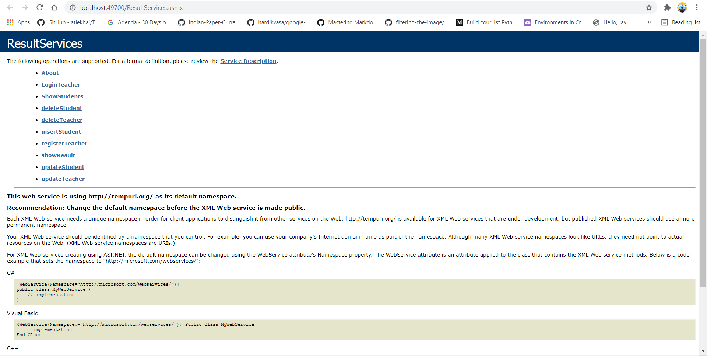
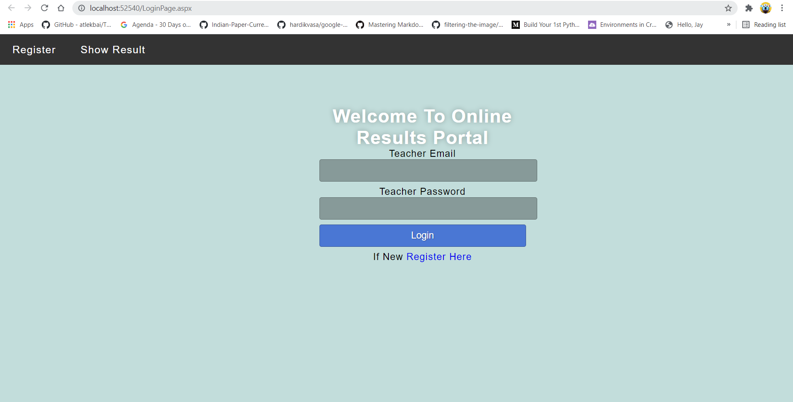
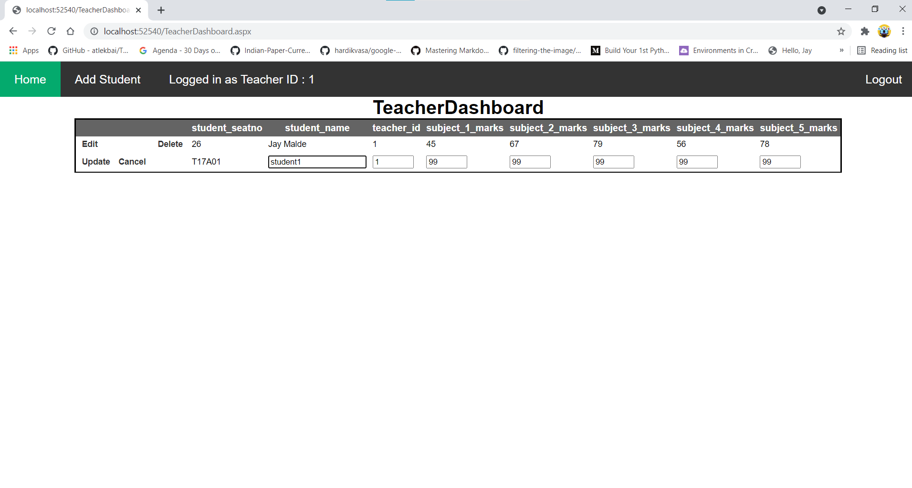
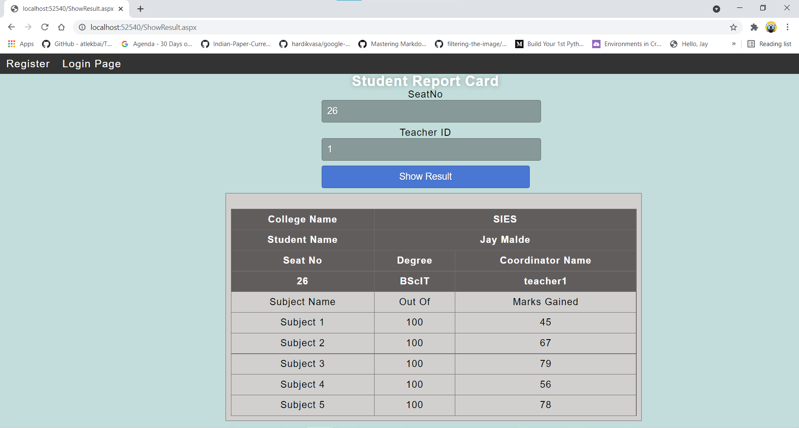

# Result-Portal-Web-Service
There are two applications first is the server part where there are POCO classes & Web Service which will respond to the client request. A user can view his/her result. And teacher can perform CRUD operations on students from Client Application.
# Screenshots
## Web Service

## Login Page
### I have used sql server as database

## Dashboard Page
### Updating a User from GridView

## Results Page

